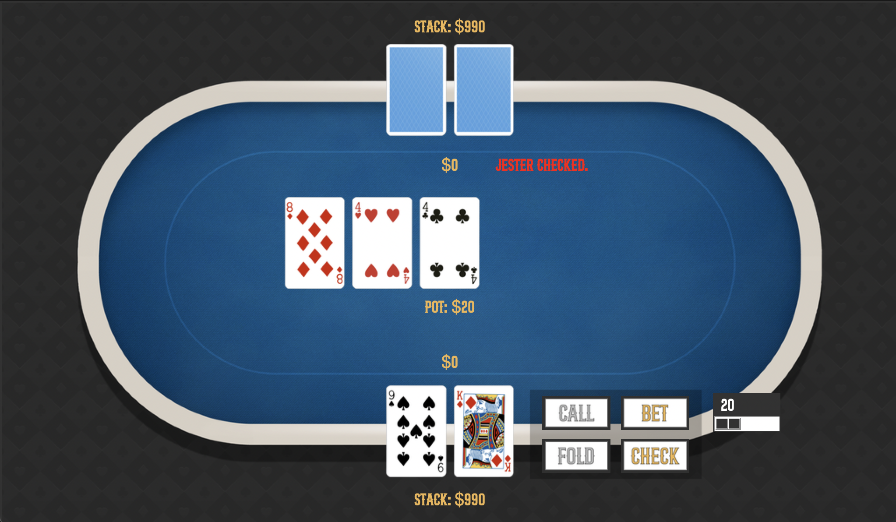

# Jester PokerBot

This PokerBot, named "Jester," plays heads-up poker against a user player, utilizing an unexploitable GTO-style strategy. I used Python and TKinter to create a functional GUI where the user can input their decisions (calling, folding, etc.) to play against Jester. The decision-making for the bot utilizes the Monte Carlo Counterfactual Regret Minimization algorithm (MCCFR) to find a Nash Equilibrium based on abstracted game states. The user plays against Jester until one of them has $0 remaining.



## How to Use

### Prerequisites
Python 3.x
- Ensure that Python version 3.x is installed on your system.

Tkinter

- Tkinter is the standard GUI library for Python and usually comes bundled with Python.
- Verify that Tkinter is installed on your system.

### Running the Application
- Run the GameWindow.py file to start the application.

- For Windows, macOS, and Linux:
  ```bash
  python3 GameWindow.py

- Use python3 if python defaults to Python 2.x on your system.

### Support
- Issues: If you encounter problems, please open an issue on the GitHub Issues page.
- Contact: For further assistance, you can contact me at dehnertdylan@gmail.com.

## Hand Evaluation Algorithm

My hand evaluation algorithm determines whether the user or bot won in the following way:
- Determines what hand ranking each player has (i.e. straight, flush, one-pair) by combining their 2 hole cards with the 5 community cards
- Returns the player with the higher hand ranking
- If equivalent hand ranking, iterate over each value in that type of ranking until one value is higher than another.

  My algorithm handles this step differently for each hand ranking. For flushes, it compares the highest flush card value, then the second-highest flush card value, and so on for all 5 flush cards. For two pair, it compares the higher pair value, then the lower pair value, and finally the kicker card value. It repeats similar procedures for the other hand ranks.
- Otherwise, both players have the same hand.

Ex. Method for determining if hand is a full house based off cards values:

        valsNoDups = list(set(vals))
        tripsCount = []
        pairCount = []

        for val in valsNoDups:
            if vals.count(val) == 3:
                tripsCount.append(val)
            elif vals.count(val) == 2:
                pairCount.append(val)

        if len(tripsCount) >= 1:
            max1 = max(tripsCount)
            tripsCount.remove(max1)

            try:
                max2 = max(tripsCount + pairCount)
            except:
                max2 = 0

            if max2 != 0:
                return [FULL_HOUSE, max1, max2]
    
        return -1
## To-Do List
This project is still a work in progress and doesn't currently have all of the intended features.
- Fix errors in game state such as illegal raises and negative stack sizes
- Fully implement and train MCCFR algorithm
- Add menu
- Improve GUI and make features clearer
- General bug fixing
